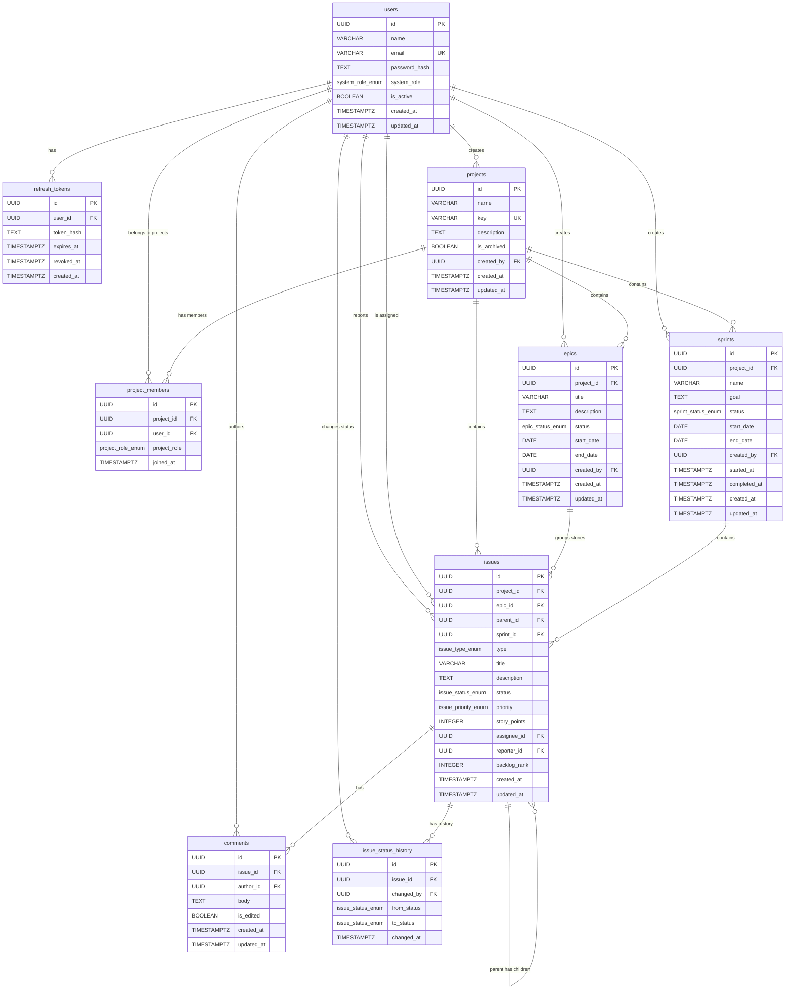

# Database Design Document
# Simplified Jira-Like Issue Tracking System

**Version:** 1.0
**Date:** 2026-03-09
**Database:** PostgreSQL 16+
**ORM:** SQLAlchemy 2.0+ (async) with Alembic migrations
**Driver:** asyncpg

---

## Table of Contents

1. [Schema Overview](#1-schema-overview)
2. [Enum Definitions](#2-enum-definitions)
3. [Table Definitions](#3-table-definitions)
4. [Foreign Key Relationships](#4-foreign-key-relationships)
5. [Indexing Strategy](#5-indexing-strategy)
6. [ER Diagram](#6-er-diagram)
7. [SQLAlchemy ORM Model Snippets](#7-sqlalchemy-orm-model-snippets)
8. [Migration Strategy](#8-migration-strategy)
9. [Query Patterns Reference](#9-query-patterns-reference)

---

## 1. Schema Overview

This database backs a Jira-like issue tracking backend built with FastAPI and SQLAlchemy (async). The design follows these principles:

- **Single PostgreSQL database** named `jira_db`. All application data lives in the `public` schema.
- **UUID primary keys everywhere.** Every table uses `gen_random_uuid()` as the server-side default for its primary key. This avoids sequential ID enumeration and simplifies distributed ID generation.
- **PostgreSQL native ENUMs.** All enumerated columns use `CREATE TYPE ... AS ENUM` rather than varchar check constraints. This provides type safety at the database level and clear documentation of allowed values.
- **TIMESTAMPTZ for all timestamps.** Every temporal column uses `TIMESTAMP WITH TIME ZONE` to eliminate timezone ambiguity. The application stores and retrieves UTC values.
- **Soft deletes pattern.** Users are deactivated via `is_active = false` rather than hard-deleted. Projects are archived via `is_archived = true`. This preserves referential integrity and audit history.
- **Single-table inheritance for issues.** Stories, Tasks, and Bugs all live in the `issues` table, discriminated by the `type` column. This simplifies queries that span issue types and avoids complex joins for polymorphic access.
- **Backlog ordering via integer rank.** Issues not assigned to a sprint are ordered by `backlog_rank` within their project. Reordering updates rank values without requiring floating-point or fractional indexing.

---

## 2. Enum Definitions

All enums are created as PostgreSQL native ENUM types before any table references them.

```sql
-- System-level role assigned to each user account
CREATE TYPE system_role_enum AS ENUM ('admin', 'project_manager', 'developer');

-- Project-level role assigned when a user joins a project
CREATE TYPE project_role_enum AS ENUM ('project_manager', 'developer');

-- Status lifecycle for epics
CREATE TYPE epic_status_enum AS ENUM ('backlog', 'in_progress', 'done');

-- Discriminator for the single issues table
CREATE TYPE issue_type_enum AS ENUM ('story', 'task', 'bug');

-- Status lifecycle for issues (stories, tasks, bugs)
CREATE TYPE issue_status_enum AS ENUM ('backlog', 'todo', 'in_progress', 'review', 'done');

-- Priority levels for issues
CREATE TYPE issue_priority_enum AS ENUM ('lowest', 'low', 'medium', 'high', 'highest');

-- Status lifecycle for sprints
CREATE TYPE sprint_status_enum AS ENUM ('planned', 'active', 'completed');
```

---

## 3. Table Definitions

### 3.1 users

Stores all user accounts in the system. Users are never hard-deleted; the `is_active` flag controls whether a user can authenticate and interact with the system.

```sql
CREATE TABLE users (
    id              UUID PRIMARY KEY DEFAULT gen_random_uuid(),
    name            VARCHAR(100)        NOT NULL,
    email           VARCHAR(255)        NOT NULL,
    password_hash   TEXT                NOT NULL,
    system_role     system_role_enum    NOT NULL DEFAULT 'developer',
    is_active       BOOLEAN             NOT NULL DEFAULT true,
    created_at      TIMESTAMPTZ         NOT NULL DEFAULT now(),
    updated_at      TIMESTAMPTZ         NOT NULL DEFAULT now(),

    CONSTRAINT uq_users_email UNIQUE (email)
);
```

**Notes:**
- `email` has a unique constraint to prevent duplicate accounts.
- `system_role` defaults to `developer` -- the least privileged role.
- `password_hash` stores a bcrypt hash; the plain password is never stored.

---

### 3.2 refresh_tokens

Stores hashed refresh tokens for JWT authentication. Each row represents one issued refresh token. Tokens are revoked by setting `revoked_at` rather than deleting the row, which preserves an audit trail.

```sql
CREATE TABLE refresh_tokens (
    id          UUID PRIMARY KEY DEFAULT gen_random_uuid(),
    user_id     UUID            NOT NULL,
    token_hash  TEXT            NOT NULL,
    expires_at  TIMESTAMPTZ     NOT NULL,
    revoked_at  TIMESTAMPTZ,
    created_at  TIMESTAMPTZ     NOT NULL DEFAULT now(),

    CONSTRAINT fk_refresh_tokens_user
        FOREIGN KEY (user_id) REFERENCES users (id) ON DELETE CASCADE
);
```

**Notes:**
- `token_hash` stores the SHA-256 hash of the raw refresh token. The raw token is returned to the client once and never stored server-side.
- `ON DELETE CASCADE` on `user_id`: if a user is hard-deleted (edge case, e.g., GDPR purge), all their refresh tokens are removed.
- `revoked_at` is NULL for active tokens and set to the revocation timestamp for logged-out or rotated tokens.

---

### 3.3 projects

Stores project definitions. Projects are never hard-deleted; they are archived via `is_archived = true`.

```sql
CREATE TABLE projects (
    id          UUID PRIMARY KEY DEFAULT gen_random_uuid(),
    name        VARCHAR(100)    NOT NULL,
    key         VARCHAR(10)     NOT NULL,
    description TEXT,
    is_archived BOOLEAN         NOT NULL DEFAULT false,
    created_by  UUID            NOT NULL,
    created_at  TIMESTAMPTZ     NOT NULL DEFAULT now(),
    updated_at  TIMESTAMPTZ     NOT NULL DEFAULT now(),

    CONSTRAINT uq_projects_key UNIQUE (key),
    CONSTRAINT chk_projects_key_format CHECK (key ~ '^[A-Z0-9]{2,10}$'),
    CONSTRAINT fk_projects_created_by
        FOREIGN KEY (created_by) REFERENCES users (id) ON DELETE RESTRICT
);
```

**Notes:**
- `key` is unique and uppercase, validated by a regex CHECK constraint. The key is used as a human-readable project identifier (e.g., "PRJ", "BACKEND") and is immutable once issues exist under the project. Immutability is enforced at the application layer.
- `ON DELETE RESTRICT` on `created_by`: prevents deleting a user who created a project. User deactivation (soft delete) is the standard path.

---

### 3.4 project_members

Join table between projects and users, storing the project-level role. Each user can be a member of a project at most once.

```sql
CREATE TABLE project_members (
    id           UUID PRIMARY KEY DEFAULT gen_random_uuid(),
    project_id   UUID                NOT NULL,
    user_id      UUID                NOT NULL,
    project_role project_role_enum   NOT NULL,
    joined_at    TIMESTAMPTZ         NOT NULL DEFAULT now(),

    CONSTRAINT uq_project_members_project_user UNIQUE (project_id, user_id),
    CONSTRAINT fk_project_members_project
        FOREIGN KEY (project_id) REFERENCES projects (id) ON DELETE CASCADE,
    CONSTRAINT fk_project_members_user
        FOREIGN KEY (user_id) REFERENCES users (id) ON DELETE CASCADE
);
```

**Notes:**
- `ON DELETE CASCADE` on both FKs: if a project is hard-deleted, its memberships are removed. If a user is hard-deleted, their memberships are removed.
- The unique constraint on `(project_id, user_id)` prevents duplicate membership and also serves as an efficient lookup index.

---

### 3.5 epics

Stores epics, which are high-level containers for stories within a project.

```sql
CREATE TABLE epics (
    id          UUID PRIMARY KEY DEFAULT gen_random_uuid(),
    project_id  UUID                NOT NULL,
    title       VARCHAR(255)        NOT NULL,
    description TEXT,
    status      epic_status_enum    NOT NULL DEFAULT 'backlog',
    start_date  DATE,
    end_date    DATE,
    created_by  UUID                NOT NULL,
    created_at  TIMESTAMPTZ         NOT NULL DEFAULT now(),
    updated_at  TIMESTAMPTZ         NOT NULL DEFAULT now(),

    CONSTRAINT fk_epics_project
        FOREIGN KEY (project_id) REFERENCES projects (id) ON DELETE CASCADE,
    CONSTRAINT fk_epics_created_by
        FOREIGN KEY (created_by) REFERENCES users (id) ON DELETE RESTRICT,
    CONSTRAINT chk_epics_dates CHECK (
        start_date IS NULL OR end_date IS NULL OR end_date >= start_date
    )
);
```

**Notes:**
- `ON DELETE CASCADE` on `project_id`: archiving is the normal path, but if a project is hard-deleted, its epics go with it.
- `ON DELETE RESTRICT` on `created_by`: prevents deleting the user who created the epic.
- The date CHECK constraint ensures `end_date` is not before `start_date` when both are provided.

---

### 3.6 sprints

Stores sprint definitions for each project. A sprint progresses through `planned -> active -> completed`.

```sql
CREATE TABLE sprints (
    id              UUID PRIMARY KEY DEFAULT gen_random_uuid(),
    project_id      UUID                NOT NULL,
    name            VARCHAR(100)        NOT NULL,
    goal            TEXT,
    status          sprint_status_enum  NOT NULL DEFAULT 'planned',
    start_date      DATE,
    end_date        DATE,
    created_by      UUID                NOT NULL,
    started_at      TIMESTAMPTZ,
    completed_at    TIMESTAMPTZ,
    created_at      TIMESTAMPTZ         NOT NULL DEFAULT now(),
    updated_at      TIMESTAMPTZ         NOT NULL DEFAULT now(),

    CONSTRAINT fk_sprints_project
        FOREIGN KEY (project_id) REFERENCES projects (id) ON DELETE CASCADE,
    CONSTRAINT fk_sprints_created_by
        FOREIGN KEY (created_by) REFERENCES users (id) ON DELETE RESTRICT,
    CONSTRAINT chk_sprints_dates CHECK (
        start_date IS NULL OR end_date IS NULL OR end_date >= start_date
    )
);
```

**Notes:**
- `started_at` and `completed_at` are set when the sprint transitions to `active` and `completed` respectively.
- `start_date` and `end_date` are planning dates (DATE type), while `started_at` and `completed_at` are precise timestamps (TIMESTAMPTZ).
- The business rule "only one active sprint per project" is enforced at the database level via a partial unique index (see Section 5).

---

### 3.7 issues

Single table for all issue types: Story, Task, and Bug. The `type` column discriminates between them. CHECK constraints enforce hierarchy rules at the database level.

```sql
CREATE TABLE issues (
    id              UUID PRIMARY KEY DEFAULT gen_random_uuid(),
    project_id      UUID                    NOT NULL,
    epic_id         UUID,
    parent_id       UUID,
    sprint_id       UUID,
    type            issue_type_enum         NOT NULL,
    title           VARCHAR(255)            NOT NULL,
    description     TEXT,
    status          issue_status_enum       NOT NULL DEFAULT 'backlog',
    priority        issue_priority_enum     NOT NULL DEFAULT 'medium',
    story_points    INTEGER,
    assignee_id     UUID,
    reporter_id     UUID                    NOT NULL,
    backlog_rank    INTEGER                 NOT NULL DEFAULT 0,
    created_at      TIMESTAMPTZ             NOT NULL DEFAULT now(),
    updated_at      TIMESTAMPTZ             NOT NULL DEFAULT now(),

    -- Foreign keys
    CONSTRAINT fk_issues_project
        FOREIGN KEY (project_id) REFERENCES projects (id) ON DELETE CASCADE,
    CONSTRAINT fk_issues_epic
        FOREIGN KEY (epic_id) REFERENCES epics (id) ON DELETE RESTRICT,
    CONSTRAINT fk_issues_parent
        FOREIGN KEY (parent_id) REFERENCES issues (id) ON DELETE CASCADE,
    CONSTRAINT fk_issues_sprint
        FOREIGN KEY (sprint_id) REFERENCES sprints (id) ON DELETE SET NULL,
    CONSTRAINT fk_issues_assignee
        FOREIGN KEY (assignee_id) REFERENCES users (id) ON DELETE SET NULL,
    CONSTRAINT fk_issues_reporter
        FOREIGN KEY (reporter_id) REFERENCES users (id) ON DELETE RESTRICT,

    -- Business rule constraints
    CONSTRAINT chk_issues_epic_only_for_story CHECK (
        (type = 'story') OR (epic_id IS NULL)
    ),
    CONSTRAINT chk_issues_parent_not_for_story CHECK (
        (type != 'story') OR (parent_id IS NULL)
    ),
    CONSTRAINT chk_issues_story_points_range CHECK (
        story_points IS NULL OR (story_points >= 0 AND story_points <= 100)
    )
);
```

**Notes:**
- **`chk_issues_epic_only_for_story`**: Ensures `epic_id` can only be set when `type = 'story'`. Tasks and bugs cannot belong directly to an epic.
- **`chk_issues_parent_not_for_story`**: Ensures stories cannot have a `parent_id`. Only tasks and bugs can be children of a story.
- **`chk_issues_story_points_range`**: Constrains `story_points` to the 0-100 range when provided.
- `ON DELETE RESTRICT` on `epic_id`: prevents deleting an epic that still has linked stories. The application must unlink or delete stories first.
- `ON DELETE CASCADE` on `parent_id`: if a parent story is deleted, its child tasks/bugs are deleted too.
- `ON DELETE SET NULL` on `sprint_id`: if a sprint is deleted, issues are returned to the backlog (sprint_id becomes NULL).
- `ON DELETE SET NULL` on `assignee_id`: if a user is hard-deleted, their assigned issues become unassigned.
- `ON DELETE RESTRICT` on `reporter_id`: the reporter is immutable and the user record must be preserved.

---

### 3.8 comments

Stores comments on issues. Comments are hard-deletable by authorized users.

```sql
CREATE TABLE comments (
    id          UUID PRIMARY KEY DEFAULT gen_random_uuid(),
    issue_id    UUID        NOT NULL,
    author_id   UUID        NOT NULL,
    body        TEXT        NOT NULL,
    is_edited   BOOLEAN     NOT NULL DEFAULT false,
    created_at  TIMESTAMPTZ NOT NULL DEFAULT now(),
    updated_at  TIMESTAMPTZ NOT NULL DEFAULT now(),

    CONSTRAINT fk_comments_issue
        FOREIGN KEY (issue_id) REFERENCES issues (id) ON DELETE CASCADE,
    CONSTRAINT fk_comments_author
        FOREIGN KEY (author_id) REFERENCES users (id) ON DELETE RESTRICT
);
```

**Notes:**
- `ON DELETE CASCADE` on `issue_id`: when an issue is deleted, all its comments are deleted.
- `ON DELETE RESTRICT` on `author_id`: preserves comment attribution. Users are soft-deleted (deactivated), not hard-deleted.
- `is_edited` is set to `true` by the application when the comment body is updated.

---

### 3.9 issue_status_history

Audit log that records every status transition on an issue. This table is append-only; rows are never updated or deleted directly.

```sql
CREATE TABLE issue_status_history (
    id          UUID PRIMARY KEY DEFAULT gen_random_uuid(),
    issue_id    UUID                NOT NULL,
    changed_by  UUID                NOT NULL,
    from_status issue_status_enum   NOT NULL,
    to_status   issue_status_enum   NOT NULL,
    changed_at  TIMESTAMPTZ         NOT NULL DEFAULT now(),

    CONSTRAINT fk_issue_status_history_issue
        FOREIGN KEY (issue_id) REFERENCES issues (id) ON DELETE CASCADE,
    CONSTRAINT fk_issue_status_history_changed_by
        FOREIGN KEY (changed_by) REFERENCES users (id) ON DELETE RESTRICT
);
```

**Notes:**
- `ON DELETE CASCADE` on `issue_id`: when an issue is deleted, its audit history is deleted with it.
- `ON DELETE RESTRICT` on `changed_by`: preserves the identity of who made each change. Users are soft-deleted, not hard-deleted.
- This table has no `updated_at` column because rows are never modified after insertion.

---

## 4. Foreign Key Relationships

### Relationship Summary Table

| Source Table | Column | References | ON DELETE | Rationale |
|---|---|---|---|---|
| `refresh_tokens` | `user_id` | `users.id` | CASCADE | Tokens are meaningless without the user |
| `projects` | `created_by` | `users.id` | RESTRICT | Preserve project creator attribution |
| `project_members` | `project_id` | `projects.id` | CASCADE | Membership removed when project deleted |
| `project_members` | `user_id` | `users.id` | CASCADE | Membership removed when user purged |
| `epics` | `project_id` | `projects.id` | CASCADE | Epics belong to a project |
| `epics` | `created_by` | `users.id` | RESTRICT | Preserve epic creator attribution |
| `sprints` | `project_id` | `projects.id` | CASCADE | Sprints belong to a project |
| `sprints` | `created_by` | `users.id` | RESTRICT | Preserve sprint creator attribution |
| `issues` | `project_id` | `projects.id` | CASCADE | Issues belong to a project |
| `issues` | `epic_id` | `epics.id` | RESTRICT | Block epic deletion when stories exist |
| `issues` | `parent_id` | `issues.id` | CASCADE | Child issues deleted with parent |
| `issues` | `sprint_id` | `sprints.id` | SET NULL | Issues return to backlog if sprint deleted |
| `issues` | `assignee_id` | `users.id` | SET NULL | Issues become unassigned if user purged |
| `issues` | `reporter_id` | `users.id` | RESTRICT | Reporter must always be identifiable |
| `comments` | `issue_id` | `issues.id` | CASCADE | Comments deleted with their issue |
| `comments` | `author_id` | `users.id` | RESTRICT | Comment author must be identifiable |
| `issue_status_history` | `issue_id` | `issues.id` | CASCADE | History deleted with the issue |
| `issue_status_history` | `changed_by` | `users.id` | RESTRICT | Audit actor must be identifiable |

### Design Rationale by Entity

**Users deleted (hard delete / GDPR purge):**
- Refresh tokens are CASCADE deleted (useless without the user).
- Project memberships are CASCADE deleted.
- Assigned issues become unassigned (SET NULL on `assignee_id`).
- RESTRICT on `reporter_id`, `created_by`, `author_id`, and `changed_by` prevents hard deletion if the user has created any project, epic, sprint, issue, or comment. In practice, users are soft-deleted via `is_active = false`, which does not trigger FK constraints.

**Projects deleted:**
- CASCADE deletes all project_members, epics, sprints, and issues. This is the nuclear option and should only happen in development or testing. In production, projects are archived (`is_archived = true`).

**Sprint deleted:**
- Issues with that `sprint_id` get SET NULL, effectively returning them to the backlog.
- Deletion is blocked at the application layer if the sprint is active or has issues.

**Epic deleted:**
- RESTRICT prevents deletion if any stories reference the epic. The application must unlink or delete stories first.

**Issue deleted:**
- CASCADE deletes all comments and status history entries for that issue.
- CASCADE deletes child issues (tasks/bugs) if the parent story is deleted.

**User deactivated (soft delete):**
- Handled entirely at the application layer. The `is_active = false` flag does not trigger any FK behavior. The application sets `assignee_id = NULL` on the user's open issues when processing deactivation.

---

## 5. Indexing Strategy

### Primary Key Indexes (Implicit)

Every table has an implicit unique B-tree index on its `id` column created by the PRIMARY KEY constraint. These are not listed below.

### Unique Constraint Indexes (Implicit)

The following unique constraints create implicit unique indexes:
- `users.email` via `uq_users_email`
- `projects.key` via `uq_projects_key`
- `project_members.(project_id, user_id)` via `uq_project_members_project_user`

### Foreign Key and Query Pattern Indexes

```sql
-- =============================================================================
-- users
-- =============================================================================

-- Lookup by email (login flow) - covered by unique constraint index
-- Filter active users
CREATE INDEX idx_users_is_active ON users (is_active);

-- =============================================================================
-- refresh_tokens
-- =============================================================================

-- Find all tokens for a user (cleanup, revocation)
CREATE INDEX idx_refresh_tokens_user_id ON refresh_tokens (user_id);

-- Token validation lookup: find token by hash
CREATE INDEX idx_refresh_tokens_token_hash ON refresh_tokens (token_hash);

-- Expired token cleanup job
CREATE INDEX idx_refresh_tokens_expires_at ON refresh_tokens (expires_at);

-- =============================================================================
-- projects
-- =============================================================================

-- Unique key lookup - covered by unique constraint index
-- Filter archived/active projects
CREATE INDEX idx_projects_is_archived ON projects (is_archived);

-- Find projects created by a specific user
CREATE INDEX idx_projects_created_by ON projects (created_by);

-- =============================================================================
-- project_members
-- =============================================================================

-- Unique (project_id, user_id) - covered by unique constraint index
-- Find all projects a user belongs to
CREATE INDEX idx_project_members_user_id ON project_members (user_id);

-- =============================================================================
-- epics
-- =============================================================================

-- List epics for a project
CREATE INDEX idx_epics_project_id ON epics (project_id);

-- Filter epics by status within a project
CREATE INDEX idx_epics_status ON epics (status);

-- Find epics created by a specific user
CREATE INDEX idx_epics_created_by ON epics (created_by);

-- =============================================================================
-- sprints
-- =============================================================================

-- List sprints for a project
CREATE INDEX idx_sprints_project_id ON sprints (project_id);

-- Find active sprint for a project (critical query, also see partial index below)
CREATE INDEX idx_sprints_project_id_status ON sprints (project_id, status);

-- Find sprints created by a specific user
CREATE INDEX idx_sprints_created_by ON sprints (created_by);

-- =============================================================================
-- PARTIAL UNIQUE INDEX: One active sprint per project
-- =============================================================================
-- This enforces the business rule that only one sprint can be in 'active' status
-- per project at any time. Any attempt to start a second sprint in the same
-- project while one is already active will raise a unique violation error.
-- This is the single most important database-level business rule enforcement
-- in the entire schema.
CREATE UNIQUE INDEX idx_sprints_one_active_per_project
    ON sprints (project_id)
    WHERE status = 'active';

-- =============================================================================
-- issues
-- =============================================================================

-- List issues for a project
CREATE INDEX idx_issues_project_id ON issues (project_id);

-- List issues in a sprint
CREATE INDEX idx_issues_sprint_id ON issues (sprint_id);

-- Find issues assigned to a user
CREATE INDEX idx_issues_assignee_id ON issues (assignee_id);

-- Find issues reported by a user
CREATE INDEX idx_issues_reporter_id ON issues (reporter_id);

-- Find stories linked to an epic
CREATE INDEX idx_issues_epic_id ON issues (epic_id);

-- Find child issues of a parent story
CREATE INDEX idx_issues_parent_id ON issues (parent_id);

-- Filter by type
CREATE INDEX idx_issues_type ON issues (type);

-- Filter by status
CREATE INDEX idx_issues_status ON issues (status);

-- Filter by priority
CREATE INDEX idx_issues_priority ON issues (priority);

-- Backlog ordering: get backlog items for a project sorted by rank
-- This composite index is critical for the backlog query:
-- WHERE project_id = ? AND sprint_id IS NULL ORDER BY backlog_rank ASC
CREATE INDEX idx_issues_project_backlog_rank ON issues (project_id, backlog_rank);

-- =============================================================================
-- comments
-- =============================================================================

-- List comments for an issue, ordered by creation time
CREATE INDEX idx_comments_issue_id_created_at ON comments (issue_id, created_at);

-- Find comments by a specific author
CREATE INDEX idx_comments_author_id ON comments (author_id);

-- =============================================================================
-- issue_status_history
-- =============================================================================

-- Get status history for an issue, ordered by time
CREATE INDEX idx_issue_status_history_issue_id_changed_at
    ON issue_status_history (issue_id, changed_at);

-- Find status changes made by a specific user
CREATE INDEX idx_issue_status_history_changed_by
    ON issue_status_history (changed_by);
```

### Index Design Notes

1. **All foreign key columns are indexed.** PostgreSQL does not automatically create indexes on FK columns (only on PK columns). Without these indexes, any DELETE or UPDATE on the referenced table would require a sequential scan on the referencing table to check FK constraints.

2. **Composite indexes are ordered for query patterns.** The `(project_id, backlog_rank)` index on issues supports the backlog query efficiently: PostgreSQL can seek to the project, then scan in rank order. The `(issue_id, created_at)` index on comments supports paginated comment listing.

3. **The partial unique index on sprints is the most important index in the schema.** It enforces the "one active sprint per project" business rule at the database level, making it impossible to violate even under concurrent requests. This is far more reliable than application-level checks alone.

---

## 6. ER Diagram



---

## 7. SQLAlchemy ORM Model Snippets

### Base and Mixins

```python
# app/models/base.py
import uuid
from datetime import datetime

from sqlalchemy import DateTime, func
from sqlalchemy.orm import DeclarativeBase, Mapped, mapped_column


class Base(DeclarativeBase):
    pass


class TimestampMixin:
    created_at: Mapped[datetime] = mapped_column(
        DateTime(timezone=True), server_default=func.now(), nullable=False
    )
    updated_at: Mapped[datetime] = mapped_column(
        DateTime(timezone=True),
        server_default=func.now(),
        onupdate=func.now(),
        nullable=False,
    )
```

### Enum Definitions (Python)

```python
# app/models/enums.py
import enum


class SystemRole(str, enum.Enum):
    admin = "admin"
    project_manager = "project_manager"
    developer = "developer"


class ProjectRole(str, enum.Enum):
    project_manager = "project_manager"
    developer = "developer"


class EpicStatus(str, enum.Enum):
    backlog = "backlog"
    in_progress = "in_progress"
    done = "done"


class IssueType(str, enum.Enum):
    story = "story"
    task = "task"
    bug = "bug"


class IssueStatus(str, enum.Enum):
    backlog = "backlog"
    todo = "todo"
    in_progress = "in_progress"
    review = "review"
    done = "done"


class IssuePriority(str, enum.Enum):
    lowest = "lowest"
    low = "low"
    medium = "medium"
    high = "high"
    highest = "highest"


class SprintStatus(str, enum.Enum):
    planned = "planned"
    active = "active"
    completed = "completed"
```

### User Model

```python
# app/models/user.py
import uuid
from datetime import datetime

from sqlalchemy import Boolean, DateTime, Enum, String, Text, func
from sqlalchemy.dialects.postgresql import UUID
from sqlalchemy.orm import Mapped, mapped_column, relationship

from app.models.base import Base, TimestampMixin
from app.models.enums import SystemRole


class User(TimestampMixin, Base):
    __tablename__ = "users"

    id: Mapped[uuid.UUID] = mapped_column(
        UUID(as_uuid=True), primary_key=True, default=uuid.uuid4,
        server_default=func.gen_random_uuid(),
    )
    name: Mapped[str] = mapped_column(String(100), nullable=False)
    email: Mapped[str] = mapped_column(
        String(255), nullable=False, unique=True
    )
    password_hash: Mapped[str] = mapped_column(Text, nullable=False)
    system_role: Mapped[SystemRole] = mapped_column(
        Enum(SystemRole, name="system_role_enum", create_type=False),
        nullable=False,
        server_default="developer",
    )
    is_active: Mapped[bool] = mapped_column(
        Boolean, nullable=False, server_default="true"
    )

    # Relationships
    refresh_tokens: Mapped[list["RefreshToken"]] = relationship(
        back_populates="user", lazy="raise"
    )
    project_memberships: Mapped[list["ProjectMember"]] = relationship(
        back_populates="user", lazy="raise"
    )
```

### RefreshToken Model

```python
# app/models/user.py (continued)
from sqlalchemy import ForeignKey


class RefreshToken(Base):
    __tablename__ = "refresh_tokens"

    id: Mapped[uuid.UUID] = mapped_column(
        UUID(as_uuid=True), primary_key=True, default=uuid.uuid4,
        server_default=func.gen_random_uuid(),
    )
    user_id: Mapped[uuid.UUID] = mapped_column(
        UUID(as_uuid=True),
        ForeignKey("users.id", ondelete="CASCADE"),
        nullable=False,
    )
    token_hash: Mapped[str] = mapped_column(Text, nullable=False)
    expires_at: Mapped[datetime] = mapped_column(
        DateTime(timezone=True), nullable=False
    )
    revoked_at: Mapped[datetime | None] = mapped_column(
        DateTime(timezone=True), nullable=True
    )
    created_at: Mapped[datetime] = mapped_column(
        DateTime(timezone=True), server_default=func.now(), nullable=False
    )

    # Relationships
    user: Mapped["User"] = relationship(
        back_populates="refresh_tokens", lazy="raise"
    )
```

### Project Model

```python
# app/models/project.py
import uuid
from datetime import datetime

from sqlalchemy import Boolean, DateTime, ForeignKey, String, Text, func
from sqlalchemy.dialects.postgresql import UUID
from sqlalchemy.orm import Mapped, mapped_column, relationship

from app.models.base import Base, TimestampMixin


class Project(TimestampMixin, Base):
    __tablename__ = "projects"

    id: Mapped[uuid.UUID] = mapped_column(
        UUID(as_uuid=True), primary_key=True, default=uuid.uuid4,
        server_default=func.gen_random_uuid(),
    )
    name: Mapped[str] = mapped_column(String(100), nullable=False)
    key: Mapped[str] = mapped_column(
        String(10), nullable=False, unique=True
    )
    description: Mapped[str | None] = mapped_column(Text, nullable=True)
    is_archived: Mapped[bool] = mapped_column(
        Boolean, nullable=False, server_default="false"
    )
    created_by: Mapped[uuid.UUID] = mapped_column(
        UUID(as_uuid=True),
        ForeignKey("users.id", ondelete="RESTRICT"),
        nullable=False,
    )

    # Relationships
    creator: Mapped["User"] = relationship(lazy="raise", foreign_keys=[created_by])
    members: Mapped[list["ProjectMember"]] = relationship(
        back_populates="project", lazy="raise"
    )
    epics: Mapped[list["Epic"]] = relationship(
        back_populates="project", lazy="raise"
    )
    sprints: Mapped[list["Sprint"]] = relationship(
        back_populates="project", lazy="raise"
    )
    issues: Mapped[list["Issue"]] = relationship(
        back_populates="project", lazy="raise"
    )
```

### ProjectMember Model

```python
# app/models/project.py (continued)
from sqlalchemy import Enum, UniqueConstraint
from app.models.enums import ProjectRole


class ProjectMember(Base):
    __tablename__ = "project_members"
    __table_args__ = (
        UniqueConstraint("project_id", "user_id", name="uq_project_members_project_user"),
    )

    id: Mapped[uuid.UUID] = mapped_column(
        UUID(as_uuid=True), primary_key=True, default=uuid.uuid4,
        server_default=func.gen_random_uuid(),
    )
    project_id: Mapped[uuid.UUID] = mapped_column(
        UUID(as_uuid=True),
        ForeignKey("projects.id", ondelete="CASCADE"),
        nullable=False,
    )
    user_id: Mapped[uuid.UUID] = mapped_column(
        UUID(as_uuid=True),
        ForeignKey("users.id", ondelete="CASCADE"),
        nullable=False,
    )
    project_role: Mapped[ProjectRole] = mapped_column(
        Enum(ProjectRole, name="project_role_enum", create_type=False),
        nullable=False,
    )
    joined_at: Mapped[datetime] = mapped_column(
        DateTime(timezone=True), server_default=func.now(), nullable=False
    )

    # Relationships
    project: Mapped["Project"] = relationship(
        back_populates="members", lazy="raise"
    )
    user: Mapped["User"] = relationship(
        back_populates="project_memberships", lazy="raise"
    )
```

### Epic Model

```python
# app/models/epic.py
import uuid
from datetime import date, datetime

from sqlalchemy import (
    CheckConstraint, Date, DateTime, Enum, ForeignKey, String, Text, func,
)
from sqlalchemy.dialects.postgresql import UUID
from sqlalchemy.orm import Mapped, mapped_column, relationship

from app.models.base import Base, TimestampMixin
from app.models.enums import EpicStatus


class Epic(TimestampMixin, Base):
    __tablename__ = "epics"
    __table_args__ = (
        CheckConstraint(
            "start_date IS NULL OR end_date IS NULL OR end_date >= start_date",
            name="chk_epics_dates",
        ),
    )

    id: Mapped[uuid.UUID] = mapped_column(
        UUID(as_uuid=True), primary_key=True, default=uuid.uuid4,
        server_default=func.gen_random_uuid(),
    )
    project_id: Mapped[uuid.UUID] = mapped_column(
        UUID(as_uuid=True),
        ForeignKey("projects.id", ondelete="CASCADE"),
        nullable=False,
    )
    title: Mapped[str] = mapped_column(String(255), nullable=False)
    description: Mapped[str | None] = mapped_column(Text, nullable=True)
    status: Mapped[EpicStatus] = mapped_column(
        Enum(EpicStatus, name="epic_status_enum", create_type=False),
        nullable=False,
        server_default="backlog",
    )
    start_date: Mapped[date | None] = mapped_column(Date, nullable=True)
    end_date: Mapped[date | None] = mapped_column(Date, nullable=True)
    created_by: Mapped[uuid.UUID] = mapped_column(
        UUID(as_uuid=True),
        ForeignKey("users.id", ondelete="RESTRICT"),
        nullable=False,
    )

    # Relationships
    project: Mapped["Project"] = relationship(
        back_populates="epics", lazy="raise"
    )
    creator: Mapped["User"] = relationship(lazy="raise", foreign_keys=[created_by])
    stories: Mapped[list["Issue"]] = relationship(
        back_populates="epic", lazy="raise"
    )
```

### Sprint Model

```python
# app/models/sprint.py
import uuid
from datetime import date, datetime

from sqlalchemy import (
    CheckConstraint, Date, DateTime, Enum, ForeignKey, Index, String, Text, func,
)
from sqlalchemy.dialects.postgresql import UUID
from sqlalchemy.orm import Mapped, mapped_column, relationship

from app.models.base import Base, TimestampMixin
from app.models.enums import SprintStatus


class Sprint(TimestampMixin, Base):
    __tablename__ = "sprints"
    __table_args__ = (
        CheckConstraint(
            "start_date IS NULL OR end_date IS NULL OR end_date >= start_date",
            name="chk_sprints_dates",
        ),
        Index(
            "idx_sprints_one_active_per_project",
            "project_id",
            unique=True,
            postgresql_where=text("status = 'active'"),
        ),
    )

    id: Mapped[uuid.UUID] = mapped_column(
        UUID(as_uuid=True), primary_key=True, default=uuid.uuid4,
        server_default=func.gen_random_uuid(),
    )
    project_id: Mapped[uuid.UUID] = mapped_column(
        UUID(as_uuid=True),
        ForeignKey("projects.id", ondelete="CASCADE"),
        nullable=False,
    )
    name: Mapped[str] = mapped_column(String(100), nullable=False)
    goal: Mapped[str | None] = mapped_column(Text, nullable=True)
    status: Mapped[SprintStatus] = mapped_column(
        Enum(SprintStatus, name="sprint_status_enum", create_type=False),
        nullable=False,
        server_default="planned",
    )
    start_date: Mapped[date | None] = mapped_column(Date, nullable=True)
    end_date: Mapped[date | None] = mapped_column(Date, nullable=True)
    created_by: Mapped[uuid.UUID] = mapped_column(
        UUID(as_uuid=True),
        ForeignKey("users.id", ondelete="RESTRICT"),
        nullable=False,
    )
    started_at: Mapped[datetime | None] = mapped_column(
        DateTime(timezone=True), nullable=True
    )
    completed_at: Mapped[datetime | None] = mapped_column(
        DateTime(timezone=True), nullable=True
    )

    # Relationships
    project: Mapped["Project"] = relationship(
        back_populates="sprints", lazy="raise"
    )
    creator: Mapped["User"] = relationship(lazy="raise", foreign_keys=[created_by])
    issues: Mapped[list["Issue"]] = relationship(
        back_populates="sprint", lazy="raise"
    )
```

**Note:** The `text("status = 'active'")` import is `from sqlalchemy import text`. This creates the partial unique index that enforces one active sprint per project at the ORM level.

### Issue Model

```python
# app/models/issue.py
import uuid
from datetime import datetime

from sqlalchemy import (
    CheckConstraint, DateTime, Enum, ForeignKey, Integer, String, Text, func,
)
from sqlalchemy.dialects.postgresql import UUID
from sqlalchemy.orm import Mapped, mapped_column, relationship

from app.models.base import Base, TimestampMixin
from app.models.enums import IssuePriority, IssueStatus, IssueType


class Issue(TimestampMixin, Base):
    __tablename__ = "issues"
    __table_args__ = (
        CheckConstraint(
            "(type = 'story') OR (epic_id IS NULL)",
            name="chk_issues_epic_only_for_story",
        ),
        CheckConstraint(
            "(type != 'story') OR (parent_id IS NULL)",
            name="chk_issues_parent_not_for_story",
        ),
        CheckConstraint(
            "story_points IS NULL OR (story_points >= 0 AND story_points <= 100)",
            name="chk_issues_story_points_range",
        ),
    )

    id: Mapped[uuid.UUID] = mapped_column(
        UUID(as_uuid=True), primary_key=True, default=uuid.uuid4,
        server_default=func.gen_random_uuid(),
    )
    project_id: Mapped[uuid.UUID] = mapped_column(
        UUID(as_uuid=True),
        ForeignKey("projects.id", ondelete="CASCADE"),
        nullable=False,
    )
    epic_id: Mapped[uuid.UUID | None] = mapped_column(
        UUID(as_uuid=True),
        ForeignKey("epics.id", ondelete="RESTRICT"),
        nullable=True,
    )
    parent_id: Mapped[uuid.UUID | None] = mapped_column(
        UUID(as_uuid=True),
        ForeignKey("issues.id", ondelete="CASCADE"),
        nullable=True,
    )
    sprint_id: Mapped[uuid.UUID | None] = mapped_column(
        UUID(as_uuid=True),
        ForeignKey("sprints.id", ondelete="SET NULL"),
        nullable=True,
    )
    type: Mapped[IssueType] = mapped_column(
        Enum(IssueType, name="issue_type_enum", create_type=False),
        nullable=False,
    )
    title: Mapped[str] = mapped_column(String(255), nullable=False)
    description: Mapped[str | None] = mapped_column(Text, nullable=True)
    status: Mapped[IssueStatus] = mapped_column(
        Enum(IssueStatus, name="issue_status_enum", create_type=False),
        nullable=False,
        server_default="backlog",
    )
    priority: Mapped[IssuePriority] = mapped_column(
        Enum(IssuePriority, name="issue_priority_enum", create_type=False),
        nullable=False,
        server_default="medium",
    )
    story_points: Mapped[int | None] = mapped_column(Integer, nullable=True)
    assignee_id: Mapped[uuid.UUID | None] = mapped_column(
        UUID(as_uuid=True),
        ForeignKey("users.id", ondelete="SET NULL"),
        nullable=True,
    )
    reporter_id: Mapped[uuid.UUID] = mapped_column(
        UUID(as_uuid=True),
        ForeignKey("users.id", ondelete="RESTRICT"),
        nullable=False,
    )
    backlog_rank: Mapped[int] = mapped_column(
        Integer, nullable=False, server_default="0"
    )

    # Relationships
    project: Mapped["Project"] = relationship(
        back_populates="issues", lazy="raise"
    )
    epic: Mapped["Epic | None"] = relationship(
        back_populates="stories", lazy="raise", foreign_keys=[epic_id]
    )
    parent: Mapped["Issue | None"] = relationship(
        back_populates="children",
        lazy="raise",
        remote_side="Issue.id",
        foreign_keys=[parent_id],
    )
    children: Mapped[list["Issue"]] = relationship(
        back_populates="parent", lazy="raise", foreign_keys="Issue.parent_id"
    )
    sprint: Mapped["Sprint | None"] = relationship(
        back_populates="issues", lazy="raise"
    )
    assignee: Mapped["User | None"] = relationship(
        lazy="raise", foreign_keys=[assignee_id]
    )
    reporter: Mapped["User"] = relationship(
        lazy="raise", foreign_keys=[reporter_id]
    )
    comments: Mapped[list["Comment"]] = relationship(
        back_populates="issue", lazy="raise"
    )
    status_history: Mapped[list["IssueStatusHistory"]] = relationship(
        back_populates="issue", lazy="raise"
    )
```

### Comment Model

```python
# app/models/comment.py
import uuid
from datetime import datetime

from sqlalchemy import Boolean, DateTime, ForeignKey, Text, func
from sqlalchemy.dialects.postgresql import UUID
from sqlalchemy.orm import Mapped, mapped_column, relationship

from app.models.base import Base, TimestampMixin


class Comment(TimestampMixin, Base):
    __tablename__ = "comments"

    id: Mapped[uuid.UUID] = mapped_column(
        UUID(as_uuid=True), primary_key=True, default=uuid.uuid4,
        server_default=func.gen_random_uuid(),
    )
    issue_id: Mapped[uuid.UUID] = mapped_column(
        UUID(as_uuid=True),
        ForeignKey("issues.id", ondelete="CASCADE"),
        nullable=False,
    )
    author_id: Mapped[uuid.UUID] = mapped_column(
        UUID(as_uuid=True),
        ForeignKey("users.id", ondelete="RESTRICT"),
        nullable=False,
    )
    body: Mapped[str] = mapped_column(Text, nullable=False)
    is_edited: Mapped[bool] = mapped_column(
        Boolean, nullable=False, server_default="false"
    )

    # Relationships
    issue: Mapped["Issue"] = relationship(
        back_populates="comments", lazy="raise"
    )
    author: Mapped["User"] = relationship(lazy="raise")
```

### IssueStatusHistory Model

```python
# app/models/issue_status_history.py
import uuid
from datetime import datetime

from sqlalchemy import DateTime, Enum, ForeignKey, func
from sqlalchemy.dialects.postgresql import UUID
from sqlalchemy.orm import Mapped, mapped_column, relationship

from app.models.base import Base
from app.models.enums import IssueStatus


class IssueStatusHistory(Base):
    __tablename__ = "issue_status_history"

    id: Mapped[uuid.UUID] = mapped_column(
        UUID(as_uuid=True), primary_key=True, default=uuid.uuid4,
        server_default=func.gen_random_uuid(),
    )
    issue_id: Mapped[uuid.UUID] = mapped_column(
        UUID(as_uuid=True),
        ForeignKey("issues.id", ondelete="CASCADE"),
        nullable=False,
    )
    changed_by: Mapped[uuid.UUID] = mapped_column(
        UUID(as_uuid=True),
        ForeignKey("users.id", ondelete="RESTRICT"),
        nullable=False,
    )
    from_status: Mapped[IssueStatus] = mapped_column(
        Enum(IssueStatus, name="issue_status_enum", create_type=False),
        nullable=False,
    )
    to_status: Mapped[IssueStatus] = mapped_column(
        Enum(IssueStatus, name="issue_status_enum", create_type=False),
        nullable=False,
    )
    changed_at: Mapped[datetime] = mapped_column(
        DateTime(timezone=True), server_default=func.now(), nullable=False
    )

    # Relationships
    issue: Mapped["Issue"] = relationship(
        back_populates="status_history", lazy="raise"
    )
    actor: Mapped["User"] = relationship(lazy="raise")
```

---

## 8. Migration Strategy

### Alembic Configuration

Alembic is configured for async operation using `asyncpg`. The `alembic/env.py` file uses `run_async()` to execute migrations within an async context.

### Initial Migration: Table Creation Order

Tables must be created in dependency order. The initial migration follows this sequence:

1. **Create all ENUM types** -- `system_role_enum`, `project_role_enum`, `epic_status_enum`, `issue_type_enum`, `issue_status_enum`, `issue_priority_enum`, `sprint_status_enum`
2. **`users`** -- no foreign key dependencies
3. **`refresh_tokens`** -- depends on `users`
4. **`projects`** -- depends on `users` (via `created_by`)
5. **`project_members`** -- depends on `projects` and `users`
6. **`sprints`** -- depends on `projects` and `users`
7. **`epics`** -- depends on `projects` and `users`
8. **`issues`** -- depends on `projects`, `epics`, `sprints`, `users`, and self-references `issues`
9. **`comments`** -- depends on `issues` and `users`
10. **`issue_status_history`** -- depends on `issues` and `users`

### Self-Referential FK Handling

The `issues` table has a self-referential foreign key (`parent_id` references `issues.id`). Alembic handles this correctly because the FK constraint is defined on the same table. PostgreSQL creates the table first, then adds the FK constraint, so no special handling is needed. If issues arise, the FK can be added as a separate `ALTER TABLE` step after table creation.

### Migration File Naming Convention

Alembic auto-generates migration files with the pattern:

```
alembic/versions/{revision_hash}_{description}.py
```

Use descriptive names when generating migrations:

```bash
# Generate initial schema
alembic revision --autogenerate -m "create_initial_schema"

# Generate subsequent migrations
alembic revision --autogenerate -m "add_index_on_issues_status"
```

### Running Migrations

```bash
# Apply all pending migrations (upgrade to latest)
alembic upgrade head

# Rollback the most recent migration
alembic downgrade -1

# Rollback to a specific revision
alembic downgrade <revision_hash>

# View current migration state
alembic current

# View migration history
alembic history --verbose

# Preview SQL without executing (dry run)
alembic upgrade head --sql
```

### Testing Migrations

Every migration should be tested with an upgrade/downgrade round-trip:

```bash
# Apply migration
alembic upgrade head

# Verify schema is correct (run tests)
pytest tests/

# Rollback
alembic downgrade -1

# Re-apply
alembic upgrade head
```

This confirms that both the `upgrade()` and `downgrade()` functions work correctly.

### Production Migration Safety

1. **Always back up the database before migrating.** Use `pg_dump` to create a snapshot.
2. **Preview the SQL before executing.** Run `alembic upgrade head --sql` to see exactly what DDL statements will run.
3. **Run migrations in a transaction.** Alembic wraps each migration in a transaction by default. If any statement fails, the entire migration is rolled back.
4. **Test on a staging database first.** Apply the migration to a copy of production data before running it on the real database.
5. **Monitor for lock contention.** Schema changes like `ALTER TABLE ... ADD COLUMN` on large tables can acquire locks that block concurrent queries. For zero-downtime migrations on large tables, consider using `CREATE INDEX CONCURRENTLY` and adding columns with `DEFAULT NULL` (which does not rewrite the table in PostgreSQL 11+).

### Downgrade Functions

Every migration should include a `downgrade()` function that reverses the changes. For ENUM types, the downgrade must drop the type after dropping all columns and tables that reference it. For tables with data, consider whether the downgrade should preserve data or is acceptable to lose it (development vs. production context).

---

## 9. Query Patterns Reference

This section lists the most common queries the application will execute and maps each to the index that supports it. This serves as a reference for the Backend Developer when writing repository methods.

### 1. Find active sprint for a project

```sql
SELECT * FROM sprints
WHERE project_id = :project_id AND status = 'active';
```

**Index used:** `idx_sprints_one_active_per_project` (partial unique index on `project_id WHERE status = 'active'`). This index both enforces the business rule and makes the lookup a single index seek.

---

### 2. Get backlog for a project

```sql
SELECT * FROM issues
WHERE project_id = :project_id AND sprint_id IS NULL
ORDER BY backlog_rank ASC;
```

**Index used:** `idx_issues_project_backlog_rank` (composite index on `(project_id, backlog_rank)`). PostgreSQL seeks to the project, then scans in rank order. The `sprint_id IS NULL` filter is applied as a secondary filter.

---

### 3. List issues in a sprint

```sql
SELECT * FROM issues
WHERE sprint_id = :sprint_id
ORDER BY backlog_rank ASC;
```

**Index used:** `idx_issues_sprint_id`.

---

### 4. Issues assigned to a user in a project

```sql
SELECT * FROM issues
WHERE assignee_id = :user_id AND project_id = :project_id;
```

**Index used:** `idx_issues_assignee_id` (seek to user, then filter by project). For high-volume scenarios, a composite index on `(assignee_id, project_id)` could be added.

---

### 5. List comments for an issue

```sql
SELECT * FROM comments
WHERE issue_id = :issue_id
ORDER BY created_at ASC;
```

**Index used:** `idx_comments_issue_id_created_at` (composite index). PostgreSQL seeks to the issue, then scans in chronological order.

---

### 6. Validate a refresh token

```sql
SELECT * FROM refresh_tokens
WHERE token_hash = :hash AND revoked_at IS NULL AND expires_at > now();
```

**Index used:** `idx_refresh_tokens_token_hash`. The hash lookup narrows to a single row; the `revoked_at` and `expires_at` checks are applied as secondary filters.

---

### 7. Check project membership

```sql
SELECT * FROM project_members
WHERE project_id = :project_id AND user_id = :user_id;
```

**Index used:** `uq_project_members_project_user` (unique constraint index on `(project_id, user_id)`). Single index seek, guaranteed at most one result.

---

### 8. Get issue with full status history

```sql
SELECT i.*, h.*
FROM issues i
LEFT JOIN issue_status_history h ON h.issue_id = i.id
WHERE i.id = :issue_id
ORDER BY h.changed_at ASC;
```

**In SQLAlchemy, use `selectinload(Issue.status_history)` instead of a raw join:**

```python
stmt = (
    select(Issue)
    .options(selectinload(Issue.status_history))
    .where(Issue.id == issue_id)
)
```

**Index used:** `idx_issue_status_history_issue_id_changed_at` (composite index). The `selectinload` issues a second query `WHERE issue_id IN (...)` which uses this index.

---

### 9. List epics with story count

```sql
SELECT e.*, COUNT(i.id) AS story_count
FROM epics e
LEFT JOIN issues i ON i.epic_id = e.id AND i.type = 'story'
WHERE e.project_id = :project_id
GROUP BY e.id;
```

**Index used:** `idx_issues_epic_id` for the join, `idx_epics_project_id` for the WHERE clause.

---

### 10. List all projects for a user

```sql
SELECT p.* FROM projects p
INNER JOIN project_members pm ON pm.project_id = p.id
WHERE pm.user_id = :user_id AND p.is_archived = false;
```

**Index used:** `idx_project_members_user_id` to find the user's memberships, then PK lookups on `projects`. The `idx_projects_is_archived` index helps if filtering archived projects from a large table.

---

### 11. Find child issues of a story

```sql
SELECT * FROM issues
WHERE parent_id = :story_id;
```

**Index used:** `idx_issues_parent_id`.

---

### 12. Cleanup expired refresh tokens

```sql
DELETE FROM refresh_tokens
WHERE expires_at < now();
```

**Index used:** `idx_refresh_tokens_expires_at`. This can be run as a periodic maintenance task.
